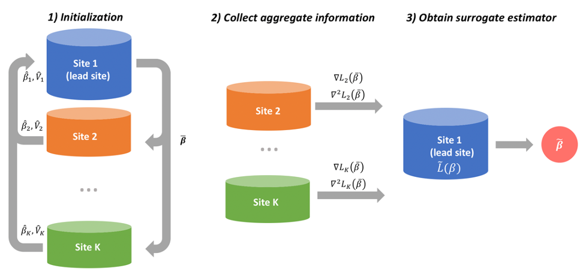

ODACH: A One-shot Distributed Algorithm for Cox model with Heterogeneous Multi-center Data
==============================================


## Outline
1. Description
2. ODACH workflow
3. Package requirements
4. Install package
5. Run ODACH
6. Results and running time
7. How to run ODACH on your data?

## Description
This README is prepared for journal peer review of the ODACH paper. The proposed ODACH algorithm can be used to fit stratified Cox proportional hazards regression using multi-center data and requires each site to communicate only some aggregate data (AD), but achieves better estimates than the meta-analysis estimates.

To demonstrate its usage, we use a lung cancer survival data of 228 patients (survival::lung) and assume the patients are from 3 sites. We analyze the association of survival time with age and sex.  

ODACH is a distributed algorithm under [PDA](https://github.com/Penncil/pda) (Privacy-preserving Distributed Algorithms) framework. The package in this repo is for the whole PDA framework, including other distributed algorithms. 

## ODACH workflow (Figure 1 in the paper)


## Package Requirements
- A database with clear and consistent variable names
- R version: R (>= 3.5.0)
- On Windows: download and install [RTools](http://cran.r-project.org/bin/windows/Rtools/) 
- To install the `pda` package, make sure you have cpp compiler as `pda` requires [Rcpp](https://cran.r-project.org/web/packages/Rcpp/vignettes/Rcpp-FAQ.pdf). This is a technical requirement for `pda` and not related to ODACH algorithm.

## Install package

To implement ODACH algorithms, we need to install the `pda` package.  

1. In RStudio, create a new project: File -> New Project... -> New Directory -> New Project. 

2. Execute the following R code: 

```r
install.packages("devtools")
library(devtools)
devtools::install_github("penncil/pda")
 
# Or you can install from CRAN:
install.packages("pda")

```

The installation time is about 20 secs via github and 5 secs via CRAN (normal personal computer). 

In the toy example below we aim to analyze the association of lung cancer survival time with age and sex using Cox PH regression, assuming site-specific  baseline hazards. We demonstrate using PDA ODACH can obtain more accurate estimates than the meta-analysis estimates (i.e. inverse variance weighted average of individual estimates from each site). 

We run the example in local directory. In actual collaboration, account/password for `pda` server will be assigned to the sites at the server https://pdamethods.org/. Each site can access via web browser to check the communication of the summary stats. Use `demo(ODACH)` for an automatic demo of the example. 

 
### *Run ODACH example with code*

Step 0: load related R packages and prepare sample data

```r
## load packages
require(pda) 
require(survival) 

## data
data(lung2)  

## split the data to 3 separate sets (patient-level data)
lung_split <- split(lung2, lung2$site)
 
``` 

Step 1: Initialization

```r
## setup pda control
sites = c('site1', 'site2', 'site3')
control <- list(project_name = 'Lung cancer study',
                step = 'initialize',
                sites = sites,
                heterogeneity = TRUE,
                model = 'ODAC',
                family = 'cox',
                outcome = "Surv(time, status)",
                variables = c('age', 'sex'),
                optim_maxit = 100,
                lead_site = 'site1',
                upload_date = as.character(Sys.time()) )

 
## specify your working directory, default is the current working dir
mydir <- getwd()   
pda(site_id = 'site1', control = control, dir = mydir)
# you now can see control.json in the working dir

## site3 communicate its individual estimate: after review, enter "1" to allow tranferring to lead site 
pda(site_id = 'site3', ipdata = lung_split[[3]], dir=mydir)
# you now can see site3_initialize.json in the working dir

## site2 communicate its individual estimate: after review, enter "1" to allow tranferring to lead site   
pda(site_id = 'site2', ipdata = lung_split[[2]], dir=mydir)
# you now can see site2_initialize.json in the working dir

## site1 communicate its individual estimate: after review, enter "1" to allow tranferring to lead site   
pda(site_id = 'site2', ipdata = lung_split[[1]], dir=mydir)
# you now can see site1_initialize.json in the working dir
# all the AD are ready, control.json is also automatically updated to the next step

``` 

STEP 2: calculate derivatives (AD)

```r 
## site3 communicate its derivatives as AD: after review, enter "1" to allow tranferring AD   
pda(site_id = 'site3', ipdata = lung_split[[3]], dir=mydir)

## site2 communicate its derivatives as AD: after review, enter "1" to allow tranferring AD
pda(site_id = 'site2', ipdata = lung_split[[2]], dir=mydir)

## site1 communicate its derivatives as AD: after review, enter "1" to allow tranferring AD
pda(site_id = 'site1', ipdata = lung_split[[1]], dir=mydir)
```


STEP 3: estimation using AD

```r  
## lead site obtain surrogate estimates using ADs
pda(site_id = 'site1', ipdata = lung_split[[1]], dir=mydir)

## the PDA ODACH is now completed! You now can see site1_estimate.json in the working dir
## All the sites can still run their own surrogate estimates and broadcast them.


## compare the surrogate estimate with the pooled and meta estimates
config <- getCloudConfig(site_id = 'site1', dir=mydir)
fit.pda <- pdaGet(name = 'site1_estimate', config = config)
control <- pdaGet('control', config)
cbind(b.pool=fit.pool$coef,
      b.meta =control$beta_init,
      b.pda=fit.pda$btilde )

```
 

## Results and Running time
Estimated log hazard ratios:

|             | b.pool  | b.meta  | b.odach |  
|-------------|---------|---------|---------| 
| age         | 0.0170  | 0.0156  | 0.0170  |  
| sex         |-0.5569  |-0.7876  |-0.5564  |   


The running time in each site in this demo is about 9-10 secs. 


## How to run ODACH on your data?

* Get the data ready, which requires no missing values and clear variable names.
* Define the `control` by specifying the model, data, outcome, variables, site names, and local site.
* Directly run `pda` function as illustrated above.
